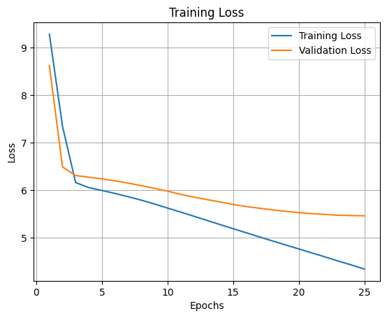
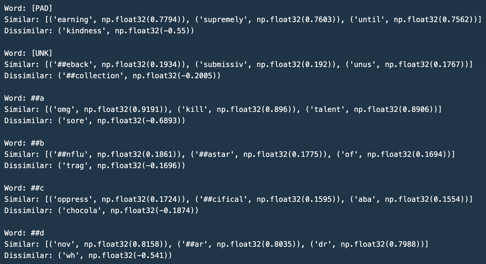

# NLP Tokenization & Language Modeling from Scratch 🧠  

This project implements core **Natural Language Processing (NLP)** components from scratch **without relying on external NLP libraries** like NLTK or Hugging Face. It is designed to provide a deep understanding of foundational NLP techniques by building a **WordPiece Tokenizer**, a **Word2Vec (CBOW) Model**, and a **Neural Language Model (MLP-based)**.  

---

## Overview 📚  

This repository covers three major NLP tasks:  

1. **Task 1**: Implementing a **WordPiece Tokenizer**.  
2. **Task 2**: Building a **Word2Vec (CBOW) Model** using PyTorch.  
3. **Task 3**: Training a **Neural Language Model (MLP-based)** with three architectural variations.  

---

## Features ✨  

- **Fully custom implementation** of a WordPiece Tokenizer.  
- **Word2Vec (CBOW) model** built using PyTorch.  
- **Neural Language Model** trained for next-word prediction.  
- **PyTorch-based training pipeline** with loss visualization.  
- **Evaluation metrics** including cosine similarity, accuracy, and perplexity.  

---

## Task 1: WordPiece Tokenizer 📝  

### Implementation Details  

- **Preprocessing**: Cleans and processes raw text data (lowercasing, removing special characters, etc.).  
- **Vocabulary Construction**: Extracts subword tokens and saves them in `vocabulary_86.txt`.  
- **Tokenization**: Converts sentences into subword tokens using the generated vocabulary.  

### Deliverables  

- `task1.py` - Contains the **WordPieceTokenizer** class.  
- `vocabulary_86.txt` - Stores the generated vocabulary.  
- `tokenized_86.json` - Output JSON file with tokenized sentences.  

---

## Task 2: Word2Vec Model (CBOW) 🧑‍💻  

### Implementation Details  

- **Dataset Preparation**: Implements `Word2VecDataset` to create training data for the CBOW model.  
- **Word2Vec Model**: Implements a CBOW-based neural network using PyTorch.  
- **Training Function**: Manages the training pipeline, including loss computation and optimization.  
- **Similarity Calculation**: Computes cosine similarity for token triplets to evaluate word relationships.  

### Deliverables  

- `task2.py` - Contains `Word2VecDataset` and `Word2VecModel` classes.  
- **Model checkpoint** after training.  
- **Loss curve visualization**.  
- **Identified token triplets** based on cosine similarity.  

**Loss Graph Output:**  
  

**Token Similarity Example:**  
  

---

## Task 3: Neural Language Model (MLP) 🧑‍🔬  

### Implementation Details  

- **Dataset Preparation**: Implements `NeuralLMDataset` for next-word prediction tasks.  
- **Three Neural Network Variations**:  
  - **NeuralLM1**: Baseline model with basic architecture.  
  - **NeuralLM2**: Modified activation functions and additional layers.  
  - **NeuralLM3**: Increased input token size for better context understanding.  
- **Training Function**: Handles training across all models.  
- **Evaluation Metrics**: Computes **accuracy and perplexity** for model evaluation.  
- **Next Token Prediction**: Predicts the next three tokens for test sentences.  

### Deliverables  

- `task3.py` - Contains dataset class and three model architectures.  
- **Training and validation loss curves**.  
- **Accuracy and perplexity scores**.  
- **Token predictions** for `test.txt`.  


**Accuracy and Perplexity Results:**  
- **Average Training Accuracy:** 96.28%  
- **Average Validation Accuracy:** 12.32%  
- **Average Training Perplexity:** 1.11  
- **Average Validation Perplexity:** 1,487,023.57  

---

## Setup and Execution 🚀  

### Prerequisites  

Ensure you have the following installed:  

- **Python 3.x**  
- **PyTorch**  
- **NumPy**  
- **Pandas**  

#### Installation  
```bash
pip install torch numpy pandas
```  

### Running the Scripts  

Run the following commands to execute each task:  

**Task 1: WordPiece Tokenizer**  
```bash
python WordPieceTokeniser.py
```

**Task 2: Word2Vec Training**  
```bash
python Word2Vec_model.py
```

**Task 3: Neural Language Model**  
```bash
python task3.py
```

---

## Results and Observations 🔍  

- The **WordPiece Tokenizer** effectively segments words into subwords.  
- The **CBOW Word2Vec model** captures meaningful word relationships.  
- The **Neural Language Models** exhibit varying performance based on architecture choices.  
- **Higher token context** improves next-word prediction accuracy.  

---

## Future Improvements 🔧  

- **Implement positional encoding** for better embeddings.  
- **Experiment with Transformer-based models** for improved performance.  
- **Extend vocabulary using larger datasets**.  

---

## Contributors 🙌  

- [Vansh Yadav](https://github.com/vansh22559)
- [Shamik Sinha](https://github.com/theshamiksinha)
- [Shrutya Chawla](https://github.com/shrutya22487)

---

## License 📄  

This project is licensed under the **MIT License**. See `LICENSE` for details.  
